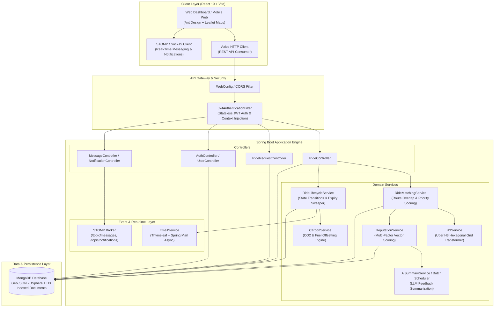

# CarPool: Next-Generation Enterprise Ride-Matching & Spatial Carpooling Platform

[](https://spring.io/projects/spring-boot)
[](https://www.oracle.com/java/)
[](https://www.mongodb.com/)
[](https://h3geo.org/)
[](https://react.dev/)
[](https://vitejs.dev/)

---

## 1. Executive Summary & Core Value Proposition

**CarPool** is an enterprise-grade, high-concurrency carpooling and real-time spatial ride-sharing platform designed to tackle urban traffic congestion, lower commuting expenses, and significantly reduce carbon emissions.

While conventional ride-hailing and carpooling platforms rely on simple origin-destination bounding boxes or radius-based spatial proximity queries, **CarPool** introduces an advanced spatial algorithm powered by **Uber H3 Hexagonal Hierarchical Spatial Indexing** combined with an **Ordered Sequence Overlap & Similarity Engine**. This enables sub-millisecond route matching, directional alignment filtering, and dynamic mid-trip candidate backup reallocation without placing heavy query loads on the underlying database.

### Key Value Pillars
- **Sub-100m Spatial Precision**: Utilizes H3 Resolution 9 (~100m hexagonal cells) to index entire vehicle trajectories as lightweight string arrays.
- **Direction-Enforced Route Traversal**: Eliminates reverse-direction matching bugs by validating forward index sequence ordering along a driver's trajectory.
- **Dynamic Mid-Trip Ad-Hoc Rematching**: Automatically ranks backup riders using multi-factor priority scoring ($PriorityScore = Similarity \times 100 + ReputationAvg - PickupDistanceKm$) when seats open up mid-journey.
- **Multi-Dimensional Reputation Matrix**: Replaces simplistic 1-5 star ratings with mathematically calculated Trust, Reliability, and Comfort vectors coupled with AI-synthesized qualitative feedback summaries.
- **Quantified Sustainability Engine**: Audits environmental impact in real time by calculating fuel avoided ($0.08\,\text{L/km}$) and net $\text{CO}_2$ offset ($2.33\,\text{kg/L}$) per passenger, crediting user environmental profiles.

---

## 2. High-Level Architecture Diagram



---

## 3. Competitive Advantage & Differentiators

| Feature Dimension | Legacy Carpooling Apps (e.g., BlaBlaCar, Waze Carpool) | CarPool Architecture | Technical & Business Impact |
| :--- | :--- | :--- | :--- |
| **Spatial Matching Mechanism** | Radius/Bounding-box search between Origin & Destination points. | **Uber H3 Resolution 9 Hexagonal Grid Indexing** with trajectory discretized into cell sequences. | Eliminates false-positive matches for parallel or non-overlapping transit corridors; reduces database query latency from $O(N)$ spatial scans to $O(1)$ set intersections. |
| **Route Direction Enforcement** | Frequently matches passengers traveling in opposite directions along the same highway. | **Ordered Cell Sequence Matching**. Rejects matches where passenger pickup cell occurs after drop-off cell index in driver's route. | 100% guarantee that driver only picks up passengers along their forward direction of travel. |
| **Mid-Trip Cancellation Handling** | Vacated seats remain empty or require driver to manually publish a new ride. | **Dynamic Ad-Hoc Backup Candidate Engine**. Ranks pending ride requests in real-time when a seat is vacated. | Maximizes vehicle occupancy rate; increases driver earnings and platform utilization efficiency. |
| **User Rating System** | Standard single-scalar 1-5 star average. | **Tri-Factor Reputation Matrix** (Trust, Reliability, Comfort) + **AI LLM Qualitative Summarization**. | Prevents review inflation, isolates vehicle quality from driver punctuality, and provides concise readable feedback summaries. |
| **Sustainability Metrics** | Estimated generic carbon footprint calculations. | **Granular Per-Passenger Carbon Auditing** ($0.08\,\text{L/km}$ fuel savings $\times 2.33\,\text{kg CO}_2/\text{L}$). | Provides verified, auditable carbon offset credits for corporate sustainability compliance and gamified user incentives. |

---

## 4. Technology Stack & Architectural Justifications

### Backend: Java 17 + Spring Boot 3.x / 4.x
- **Why over Node.js / Python?**: Carpooling matching involves compute-heavy spatial operations (coordinate rounding, H3 grid transformations, Haversine calculations, set intersections). Java's strong typing, JIT compilation, multi-threading capabilities, and rich enterprise ecosystem deliver superior throughput and lower latency under high concurrent load compared to single-threaded Node.js or dynamic Python interpreters.
- **Spring Security + JWT**: Provides stateless, token-based authentication with low overhead and seamless extension for role-based access control (`ROLE_USER`, `ROLE_ADMIN`).

### Spatial Indexing: Uber H3 (`com.uber:h3`)
- **Why over traditional PostGIS / GIS spatial queries?**: Traditional PostGIS geometry queries (`ST_Buffer`, `ST_Intersects`) require complex spatial database indexes and CPU-heavy geometric calculations at query time. Uber H3 discretizes the globe into hexagonal cells represented as standard 64-bit integers (or 15-character hex strings). Checking spatial overlap translates to fast hash set intersections (`Set.retainAll()`) in RAM.

### Database: MongoDB with GeoJSON 2DSphere
- **Why over PostgreSQL?**: Ride trajectories, H3 cell segments, environmental execution details, and dynamic user profiles are semi-structured documents that evolve without requiring strict relational migrations. MongoDB's native support for GeoJSON format (`Point`, `LineString`) and 2DSphere spatial indexing complements the H3 spatial layer for initial geospatial bounds filtering.

### Real-Time Engine: WebSocket with STOMP & SockJS
- **Why over HTTP Polling or Server-Sent Events (SSE)?**: Carpooling workflows demand bidirectional communication: riders need real-time ride status changes, drivers need instantaneous backup rider suggestions, and both require latency-free chat. STOMP over WebSocket provides structured publish/subscribe channels (`/topic/rides/{id}`, `/topic/notifications/{userId}`) with automated fallback via SockJS.

### Frontend: React 19 + Vite + Leaflet + SCSS
- **Why Vite + React 19?**: Instant Server Start, lightning-fast HMR (Hot Module Replacement), and minimal bundle footprint. React 19 provides enhanced concurrent rendering capabilities.
- **Leaflet & React-Leaflet**: Lightweight, highly customisable vector map rendering engine for visualizing H3 routes, pickup points, and dynamic driver trajectories without heavy commercial SDK dependencies.

---

## 5. Quick Start Guide & Local Development Setup

### Prerequisites
- **Java Development Kit (JDK)**: Version 17 or higher
- **Node.js**: Version 18.x or higher (with `npm` v9+)
- **MongoDB**: Local MongoDB instance listening on `localhost:27017` or a MongoDB Atlas URI
- **Maven**: Version 3.8+ (or use the embedded `./mvnw` wrapper)

---

### Step 1: Clone & Configure Workspace
```bash
git clone https://github.com/PranavKB/ac_project.git
cd ac_project
```

### Step 2: Backend Setup & Execution
1. Navigate to the backend directory:
   ```bash
   cd backend
   ```
2. Verify environment configuration in `src/main/resources/application.properties` (or set environment variables):
   ```properties
   spring.data.mongodb.uri=mongodb://localhost:27017/carpooling_db
   jwt.secret=YourSuperSecretKeyWithAtLeast256BitsOfEntropyForHS256Signing!
   jwt.expiration=86400000
   server.port=8080
   ```
3. Build and run the Spring Boot service:
   ```bash
   # Using Maven Wrapper (Windows)
   mvnw.cmd spring-boot:run

   # Using Maven Wrapper (Linux/macOS)
   ./mvnw spring-boot:run
   ```
4. Access Swagger API Documentation:
   Navigate to `http://localhost:8080/swagger-ui.html` or `http://localhost:8080/v3/api-docs`.

---

### Step 3: Frontend Setup & Execution
1. Open a new terminal and navigate to the frontend directory:
   ```bash
   cd frontend
   ```
2. Install dependencies:
   ```bash
   npm install
   ```
3. Start the Vite development server:
   ```bash
   npm run dev
   ```
4. Open your browser and navigate to `http://localhost:5173`.

---

## 6. Deployment Architecture Overview

```
                          [ Internet Traffic ]
                                   │
                                   ▼
                      [ NGINX Reverse Proxy / ALB ]
                     ┌─────────────┴─────────────┐
                     │  SSL Termination & CORS  │
                     └─────────────┬─────────────┘
                                   │
           ┌───────────────────────┴───────────────────────┐
           ▼                                               ▼
┌───────────────────────────┐                   ┌───────────────────────────┐
│ Spring Boot Container #1  │                   │ Spring Boot Container #2  │
│ (Java 17 / Docker)        │                   │ (Java 17 / Docker)        │
│ - REST Endpoints          │                   │ - REST Endpoints          │
│ - STOMP WebSockets        │                   │ - STOMP WebSockets        │
│ - Scheduled Sweepers      │                   │ - Scheduled Sweepers      │
└─────────────┬─────────────┘                   └─────────────┬─────────────┘
              │                                               │
              └───────────────────────┬───────────────────────┘
                                      │
                                      ▼
                   ┌────────────────────────────────────┐
                   │  MongoDB Replica Set / Atlas Cluster│
                   │  - 2DSphere Indexes                │
                   │  - H3 Spatial Route Segments       │
                   └────────────────────────────────────┘
```

- **Containerization**: Backend packaged via Docker multi-stage builds (`eclipse-temurin:17-jdk-alpine`). Frontend deployed as static artifacts via NGINX or Vercel/Netlify.
- **Stateless Scaling**: Spring Boot application nodes are stateless; user authentication state is managed via signed JWT tokens, enabling horizontal scaling behind an AWS Application Load Balancer or NGINX.
- **Database Resilience**: MongoDB Replica Set ensures high availability, read scalabilty, and automatic failover.
