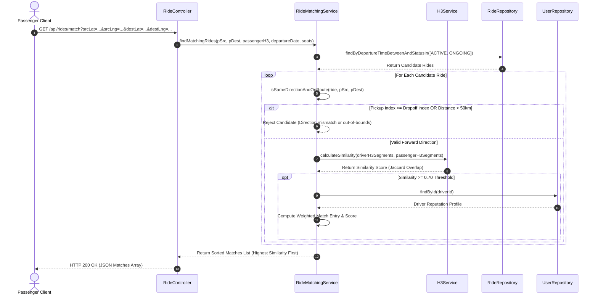
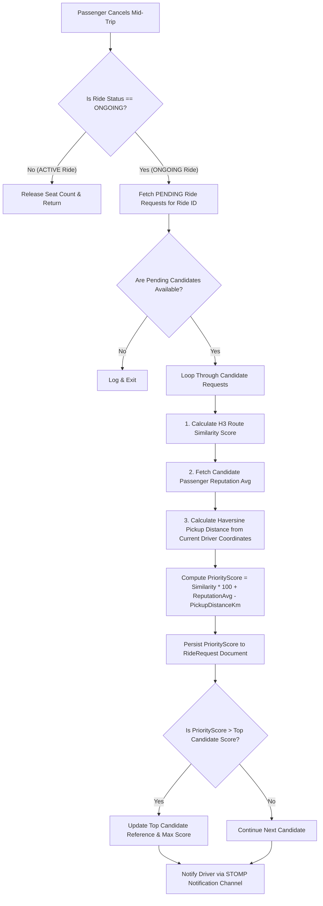

# Low-Level Design & Engineering Decisions

This document details the component architecture, design patterns, data models, performance optimizations, and security mechanics governing the **CarPool** backend application.

---

## 1. Component Breakdown & Design Patterns

### 1.1 Design Patterns Matrix

| Design Pattern | Context & Location in Codebase | Justification & Architectural Benefit |
| :--- | :--- | :--- |
| **Singleton Pattern** | [`H3Service.java`](file:///g:/2026/DAC%20project/ac_project/backend/src/main/java/com/cdac/carpooling/service/H3Service.java#L18) (`H3Core` initialization) | `H3Core` encapsulates native C-bindings. Initializing it once via `@PostConstruct` guarantees thread-safe, single-instance reuse across thread pools, avoiding expensive C library reload overhead. |
| **State Machine Pattern** | [`RideLifecycleService.java`](file:///g:/2026/DAC%20project/ac_project/backend/src/main/java/com/cdac/carpooling/service/RideLifecycleService.java) | Manages legal state transitions (`ACTIVE` $\rightarrow$ `ONGOING` $\rightarrow$ `COMPLETED` / `CANCELLED`), preventing illegal state jumps (e.g., direct jump from `CANCELLED` to `COMPLETED`). |
| **Strategy Pattern** | [`RideMatchingService.java`](file:///g:/2026/DAC%20project/ac_project/backend/src/main/java/com/cdac/carpooling/service/RideMatchingService.java) & [`ReputationService.java`](file:///g:/2026/DAC%20project/ac_project/backend/src/main/java/com/cdac/carpooling/service/ReputationService.java) | Encapsulates distinct matching algorithms: Ordered H3 Cell Similarity for pre-trip matching, and Priority Score Ranking for dynamic mid-trip backup candidates. |
| **Observer / Pub-Sub Pattern** | [`WebSocketConfig.java`](file:///g:/2026/DAC%20project/ac_project/backend/src/main/java/com/cdac/carpooling/config/WebSocketConfig.java) & [`NotificationService.java`](file:///g:/2026/DAC%20project/ac_project/backend/src/main/java/com/cdac/carpooling/service/NotificationService.java) | Decouples event generation (e.g., backup rider suggested, ride completed) from UI rendering via STOMP topic channels (`/topic/notifications/{userId}`). |
| **Data Transfer Object (DTO) Pattern** | `com.cdac.carpooling.dto.*` | Isolates internal persistence models (MongoDB `@Document` entities) from external API contracts, preventing over-exposure of confidential fields (e.g., password hashes). |

---

### 1.2 Detailed Component Interaction Diagrams

#### A. Spatial Matching & Direction-Enforced Filtering Workflow



---

#### B. Dynamic Mid-Trip Ad-Hoc Backup Candidate Rematching Strategy



---

## 2. Data Modeling & Database Schema Design

The system leverages **MongoDB** for document flexibility, native GeoJSON support, and fast spatial query processing.

### 2.1 Collection Schemas & Data Structures

#### Collection: `users`
```json
{
  "_id": "64f1a2b3c4d5e6f7a8b9c0d1",
  "name": "Jane Doe",
  "email": "jane.doe@example.com",
  "password": "$2a$10$e8ZzP...hashed_bcrypt_password...",
  "role": "ROLE_USER",
  "totalCarbonSavedKg": 42.50,
  "reputationProfile": {
    "trustScore": 92.40,
    "reliabilityScore": 88.50,
    "comfortScore": 95.00,
    "aiSummary": "Excellent reputation: highly trusted, punctual, and safe driver."
  },
  "createdAt": "2026-01-15T08:30:00Z"
}
```

#### Collection: `rides`
```json
{
  "_id": "64f1a2b3c4d5e6f7a8b9c0d2",
  "driverId": "64f1a2b3c4d5e6f7a8b9c0d1",
  "source": {
    "name": "Financial District, City Center",
    "location": { "type": "Point", "coordinates": [73.8567, 18.5204] }
  },
  "destination": {
    "name": "Tech Park North",
    "location": { "type": "Point", "coordinates": [73.9141, 18.5679] }
  },
  "routeCoords": [ [18.5204, 73.8567], [18.5400, 73.8800], [18.5679, 73.9141] ],
  "h3RouteSegments": [ "89601430007ffff", "8960143000bffff", "8960143000fffff" ],
  "status": "ONGOING",
  "availableSeats": 2,
  "departureTime": "2026-08-16T18:00:00Z",
  "estimatedDurationMinutes": 45,
  "currentLocation": [18.5400, 73.8800],
  "passengerIds": [ "64f1a2b3c4d5e6f7a8b9c0d9" ],
  "executionDetails": {
    "startTime": "2026-08-16T18:02:10Z",
    "endTime": null,
    "actualDistanceKm": 18.40,
    "environmentalOffset": { "avoidedFuelLiters": 1.47, "netReducedCo2Kg": 3.43 }
  }
}
```

#### Collection: `ride_requests`
```json
{
  "_id": "64f1a2b3c4d5e6f7a8b9c0d3",
  "rideId": "64f1a2b3c4d5e6f7a8b9c0d2",
  "passengerId": "64f1a2b3c4d5e6f7a8b9c0d9",
  "passengerName": "Alex Smith",
  "source": {
    "name": "Midtown Avenue",
    "location": { "type": "Point", "coordinates": [73.8700, 18.5300] }
  },
  "destination": {
    "name": "Tech Park Entrance Gate 2",
    "location": { "type": "Point", "coordinates": [73.9100, 18.5600] }
  },
  "passengerH3Segments": [ "8960143000bffff", "8960143000fffff" ],
  "status": "PENDING",
  "priorityScore": 145.80,
  "requestedSeats": 1
}
```

---

### 2.2 Database Indexing Strategies

To ensure sub-millisecond query performance under scaling data volumes, MongoDB compound and spatial indexes are defined:

```javascript
// 1. 2DSphere Spatial Indexing for Source/Destination Location Queries
db.rides.createIndex({ "source.location": "2dsphere" });
db.rides.createIndex({ "destination.location": "2dsphere" });

// 2. Compound Index for Ride Matching & Expiry Sweeper Optimization
db.rides.createIndex({ "status": 1, "departureTime": 1 });

// 3. Driver Rides Lookup Index
db.rides.createIndex({ "driverId": 1, "status": 1 });

// 4. Ride Requests Index for Dynamic Backup Candidates Lookup
db.ride_requests.createIndex({ "rideId": 1, "status": 1 });

// 5. Ratings Aggregation Index
db.ratings.createIndex({ "reviewedUserId": 1 });
```

---

## 3. Performance Optimizations & System Scalability

### 3.1 Asynchronous Route Calculation (`@Async`)

When a driver creates a ride, computing full OSRM/routing geometry and converting coordinates to H3 cells can introduce HTTP latency. This computation is offloaded asynchronously:

```java
// RideMatchingService.java
@Async
public void populateRouteH3SegmentsAsync(String rideId, double srcLat, double srcLng, double destLat, double destLng) {
    try {
        List<List<Double>> routeCoords = routingService.getRouteCoordinates(srcLat, srcLng, destLat, destLng);
        List<String> fullH3 = h3Service.pathToH3Segments(routeCoords);

        Ride ride = rideRepository.findById(rideId).orElse(null);
        if (ride != null && "ACTIVE".equals(ride.getStatus())) {
            ride.setH3RouteSegments(fullH3);
            ride.setRouteCoords(routeCoords);
            rideRepository.save(ride);
        }
    } catch (Exception e) {
        System.err.println("Async H3 generation failed: " + e.getMessage());
    }
}
```

### 3.2 Scheduled Automated Expiry Sweeper (`@Scheduled`)

Rides whose departure time has passed without driver confirmation are automatically resolved every 5 minutes, keeping active query working sets clean:

```java
// RideLifecycleService.java
@Scheduled(fixedRate = 300000) // Sweeps every 5 minutes
public void expireStaleRides() {
    Instant now = Instant.now();
    // 1. ACTIVE past departure time -> AUTO-CANCELLED
    List<Ride> activeRides = rideRepository.findByStatus("ACTIVE");
    for (Ride ride : activeRides) {
        if (ride.getDepartureTime() != null && ride.getDepartureTime().isBefore(now)) {
            cancelRide(ride);
        }
    }
    // 2. ONGOING past expected duration -> AUTO-COMPLETED
    List<Ride> ongoingRides = rideRepository.findByStatus("ONGOING");
    for (Ride ride : ongoingRides) {
        Instant expectedEnd = ride.getDepartureTime().plusSeconds(ride.getEstimatedDurationMinutes() * 60L);
        if (expectedEnd.isBefore(now)) {
            completeRide(ride, DEFAULT_AUTO_COMPLETE_DISTANCE_KM);
        }
    }
}
```

---

## 4. Security, Logging, & Error Handling

### 4.1 Stateless JWT Authentication Pipeline

Authentication follows a stateless Bearer token model handled via `JwtAuthenticationFilter`:

```
[ Incoming Request ]
         │
         ▼
┌────────────────────────────────────────────────────────┐
│ JwtAuthenticationFilter                                │
│ 1. Read 'Authorization' Header ('Bearer <token>')      │
│ 2. Validate JWT Signature (HS256) & Expiration         │
│ 3. Extract User Email & Claims                         │
│ 4. Build UsernamePasswordAuthenticationToken           │
│ 5. Populate SecurityContextHolder                      │
└────────────────────────┬───────────────────────────────┘
                         │
                         ▼
[ Spring SecurityFilterChain ] ──> Proceed to Controller
```

- **Password Encryption**: All passwords hashed using BCrypt (`BCryptPasswordEncoder` with strength factor 10).
- **CORS Configuration**: Restricts origin requests via `WebConfig`, permitting configured domain patterns while guarding against unauthorized cross-site requests.
- **WebSocket Channel Authorization**: STOMP subscriptions to private notification paths (`/topic/notifications/{userId}`) inspect JWT session tokens during connection handshakes.

### 4.2 Logging & Observability

- **Structured Logging**: Services use `@Slf4j` for lifecycle state changes, automated sweeper actions, and route calculation failures.
- **Auditing**: Sensitive transactions (ride cancellation, reputation adjustments, carbon credits) output explicit audit log entries containing user IDs, timestamps, and delta values.
